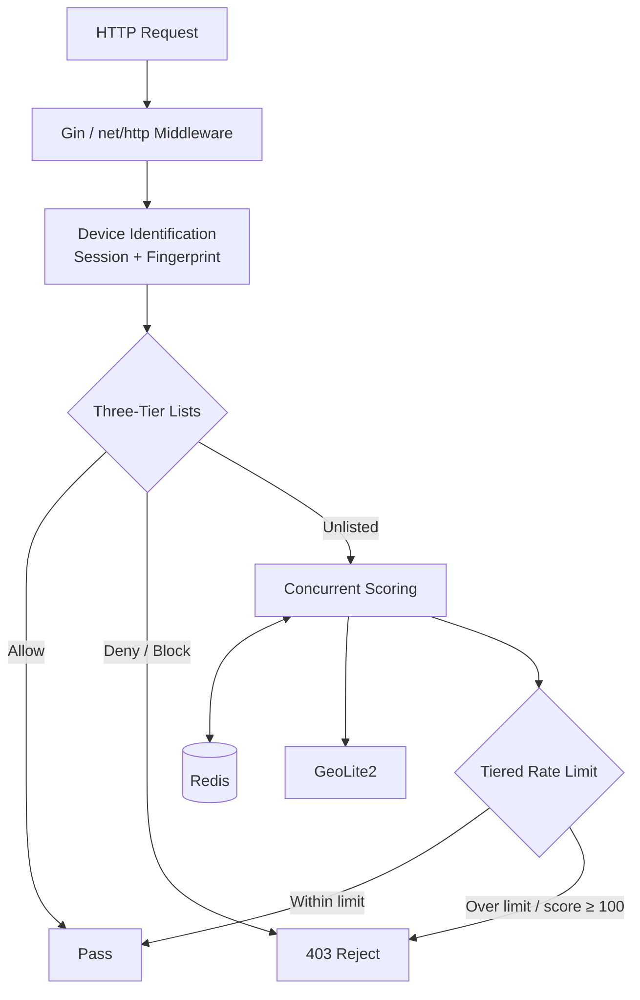

Last updated: 2026-10-07

> [!NOTE]
> This README was generated by [SKILL](https://github.com/agenvoy/skill-readme-generate), get the ZH version from [here](./doc/README.zh.md).

***

<strong>STOP MALICIOUS IPS BEFORE THEY REACH YOUR HANDLERS!</strong>

***

> A Go IP filter and rate limiting middleware with Redis IP blacklist, GeoLite2 impossible travel, and device risk scoring

## Table of Contents

- [Features](#features)
- [Architecture](#architecture)
- [License](#license)
- [Author](#author)

## Features

> `go get github.com/pardnchiu/golang-ip-sentry` · [Documentation](./doc/doc.md)

- **Concurrent Four-Dimension Scoring** — Correlation, geo, behavior, and fingerprint checks run in parallel goroutines and merge into a 0–100 score that selects a normal, suspicious, or dangerous per-minute rate limit.
- **GeoLite2 Anomaly Detection** — Haversine-based travel speed flags impossible travel above 800 km/h, multi-country hopping within an hour, and frequent city switching.
- **HMAC-Signed Session and Device Fingerprint** — An HMAC-SHA256 signed session cookie paired with a device fingerprint exposes shared accounts and proxy pools through session-to-IP and IP-to-device fan-out.
- **Bot Rhythm Recognition** — Variance across the last 10 request intervals catches scripts with unnaturally regular timing, alongside long-session, login-failure, and 404-scan signals.
- **Three-Tier IP Access Control** — Allow and Deny lists persist to both Redis and local JSON and reload on startup; Block applies exponentially growing temporary bans, and Deny can trigger email alerts.

## Architecture

> [Full Architecture](./doc/architecture.md)

## License

This project is licensed under the [MIT LICENSE](LICENSE).

## Author

Just [open an issue](https://github.com/pardnchiu/go-ip-sentry/issues/new) to share an idea.

***

©️ 2025 [邱敬幃 Pardn Chiu](https://www.linkedin.com/in/pardnchiu)
