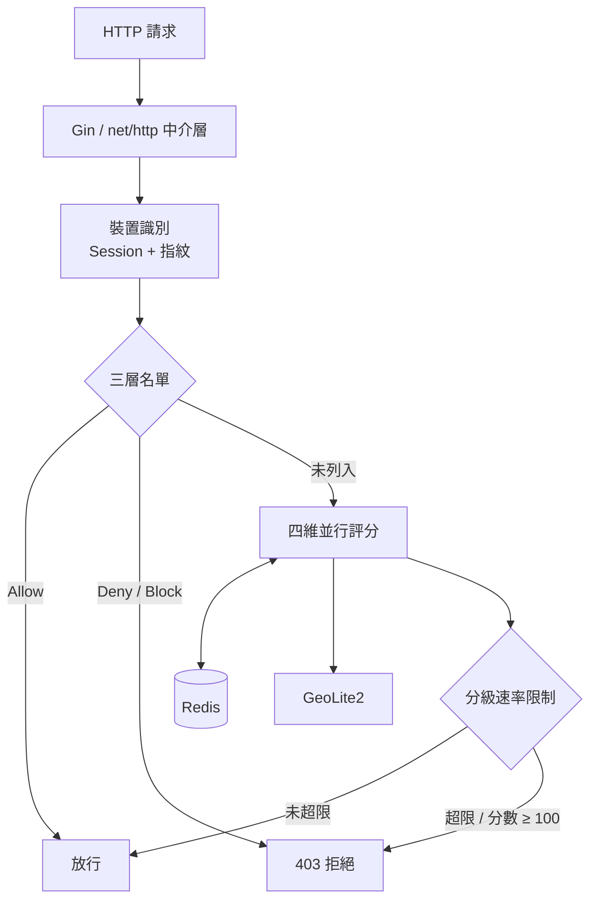

最後更新：2026-10-07

> [!NOTE]
> 此 README 由 [SKILL](https://github.com/agenvoy/skill-readme-generate) 生成，英文版請參閱 [這裡](../README.md)。

***

<strong>STOP MALICIOUS IPS BEFORE THEY REACH YOUR HANDLERS!</strong>

***

> Go IP 限流與過濾中介層，具備 Redis IP 黑名單、GeoLite2 異地登入偵測與裝置風險評分

## 目錄

- [功能特點](#功能特點)
- [架構](#架構)
- [授權](#授權)
- [Author](#author)

## 功能特點

> `go get github.com/pardnchiu/golang-ip-sentry` · [完整文件](./doc.zh.md)

- **四維並行風險評分** — 關聯、地理、行為、指紋四個維度以 goroutine 同時計算並合併為 0–100 分，依正常／可疑／危險分級套用不同的每分鐘速率上限。
- **GeoLite2 地理異常偵測** — 以 Haversine 距離推算移動速度，識別超過 800 km/h 的不可能旅行，並偵測一小時內跨多國跳躍與城市頻繁切換。
- **HMAC 簽章 Session 與裝置指紋** — 以 HMAC-SHA256 簽章的 Session Cookie 結合裝置指紋，追蹤單一 Session 多 IP、單一 IP 多裝置等共用帳號與代理池跡象。
- **機器人節律辨識** — 分析最近 10 次請求間隔的變異數，揪出間隔過度規律的自動化腳本，並納入長連線、登入失敗與 404 掃描訊號。
- **三層 IP 存取控制** — Allow／Deny 名單同步寫入 Redis 與本地 JSON 檔、啟動時自動載回；Block 以指數倍增時長暫時封鎖，Deny 可觸發 Email 通知。

## 架構

> [完整架構](./architecture.zh.md)

## 授權

本專案採用 [MIT LICENSE](../LICENSE)。

## Author

Just [open an issue](https://github.com/pardnchiu/go-ip-sentry/issues/new) to share an idea.

***

©️ 2025 [邱敬幃 Pardn Chiu](https://www.linkedin.com/in/pardnchiu)
