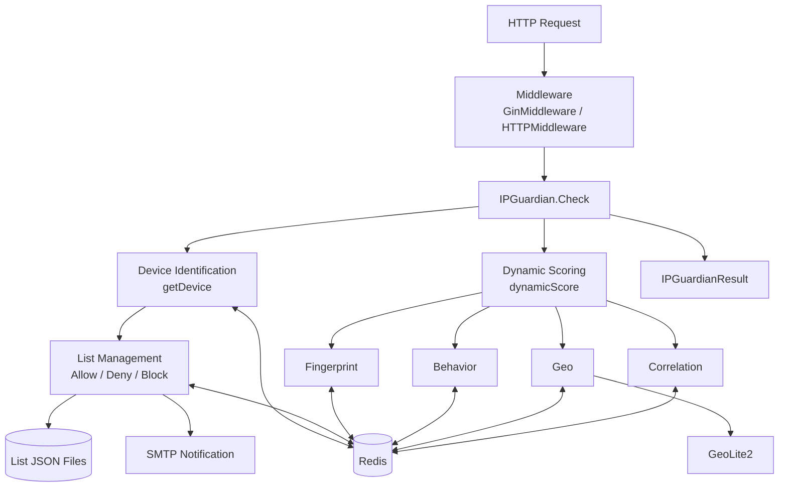
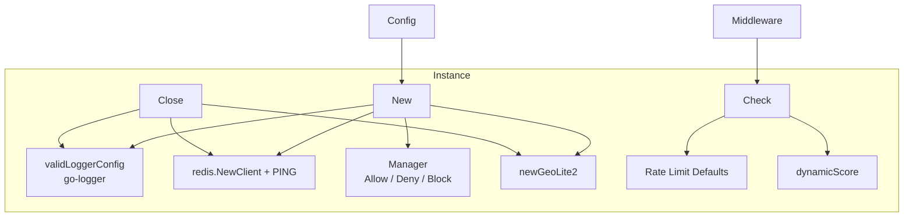
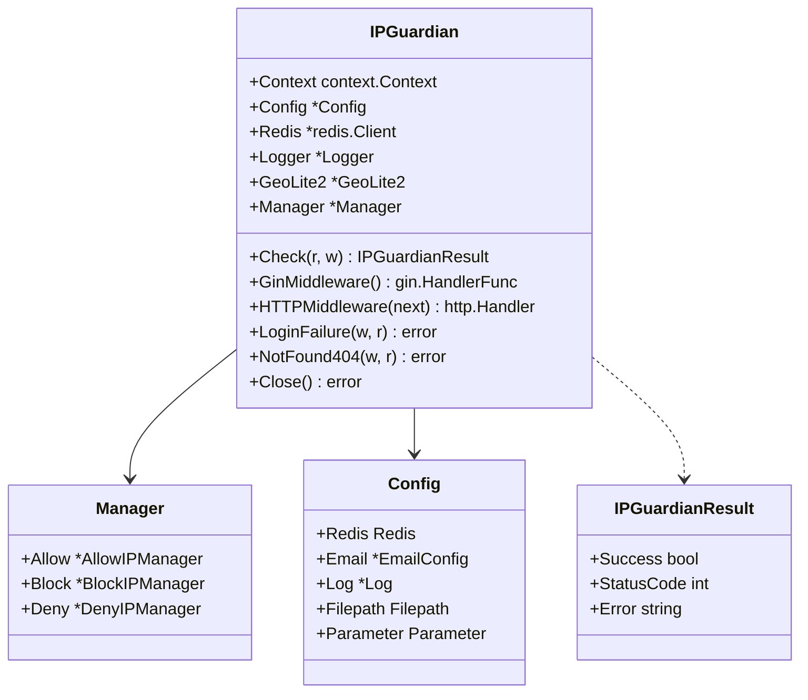
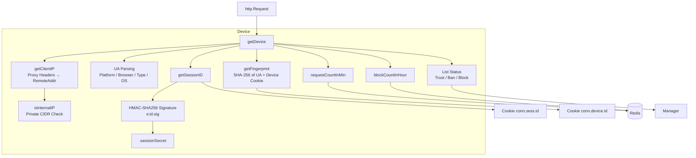
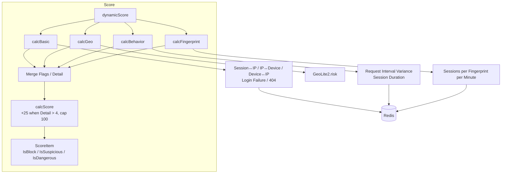
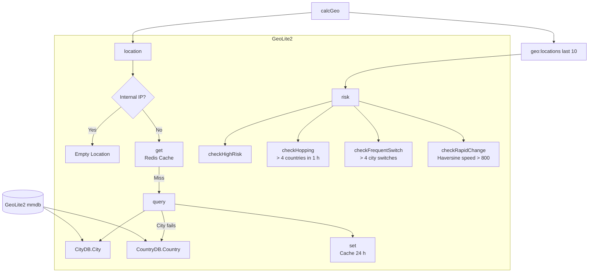
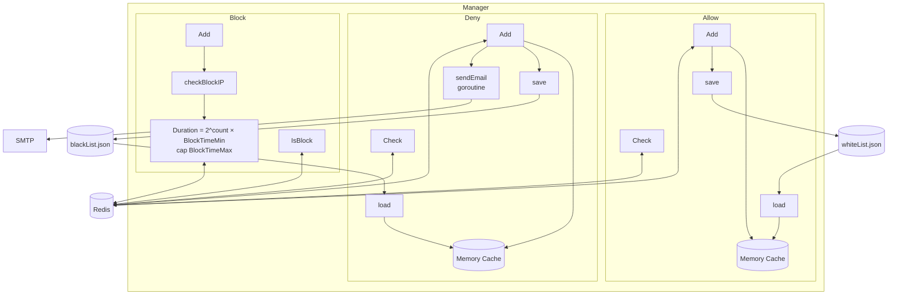
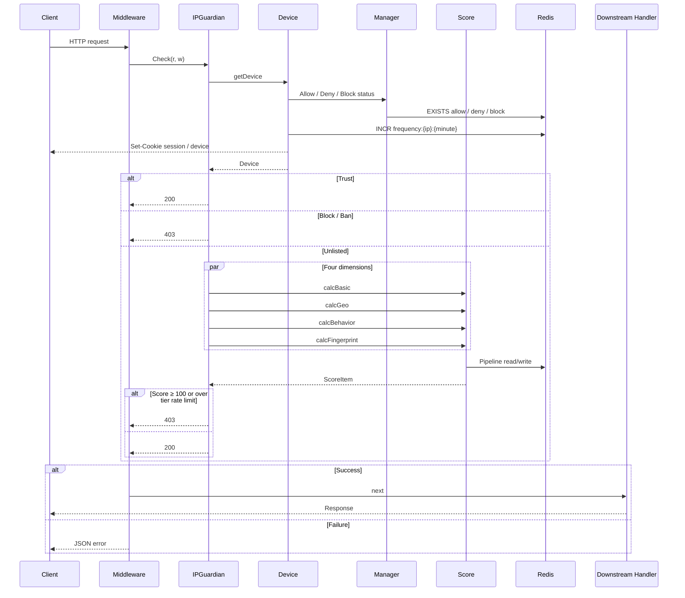
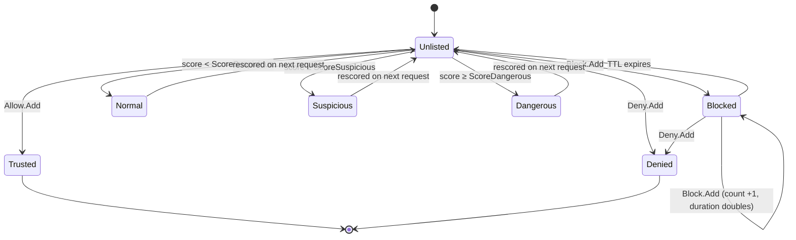

# go-ip-sentry - Architecture

Last updated: 2026-10-05

> Back to [README](../README.md)

## Overview

## Module: Instance

Creates the instance, applies defaults, and wires the check flow.

## Module: Device

Resolves the client IP, User-Agent, session, and device fingerprint from the request, and attaches list status and counters.

## Module: Score

Four dimensions run in parallel goroutines, each accumulating its own score before a mutex-guarded merge.

## Module: GeoLite2

Looks up and caches IP locations, then evaluates geo risk from the last 10 location records.

## Module: Manager

Three-tier lists: Allow and Deny are permanent and persisted to files; Block is a temporary ban with a TTL.

## Data Flow

## State Machine

State of a single IP within the Check flow.

***

©️ 2025 [邱敬幃 Pardn Chiu](https://www.linkedin.com/in/pardnchiu)
