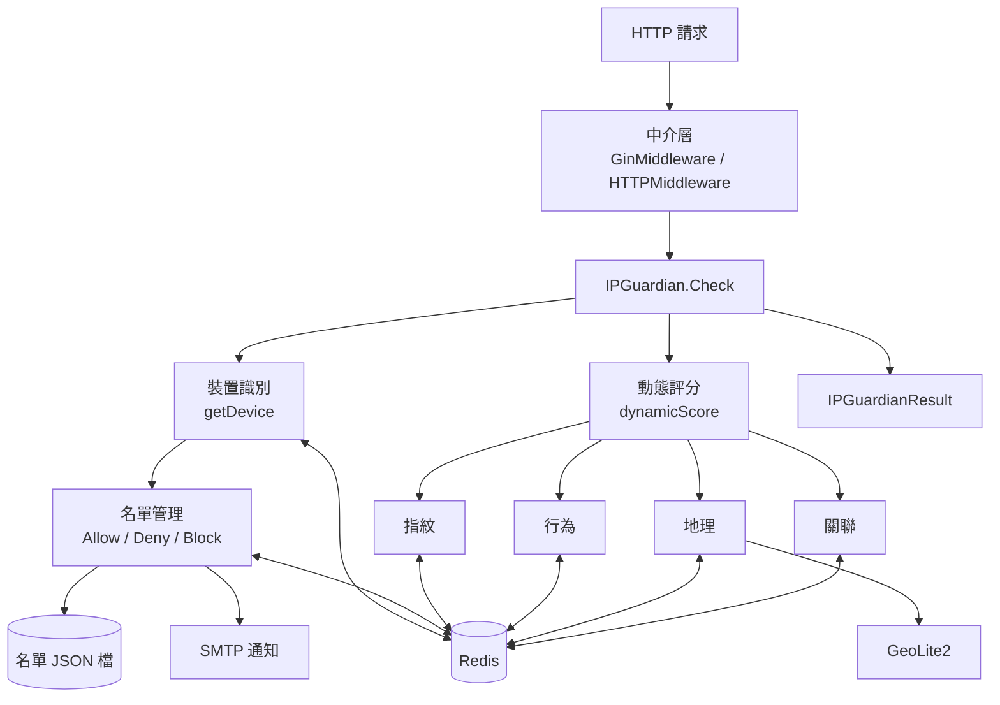
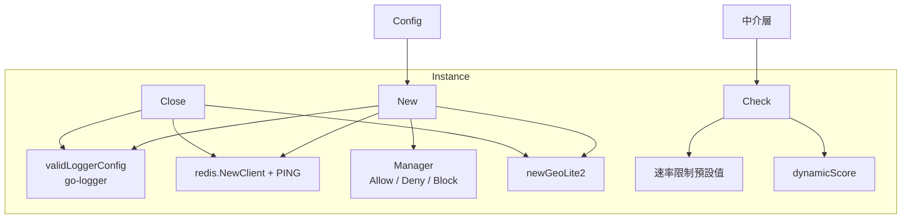
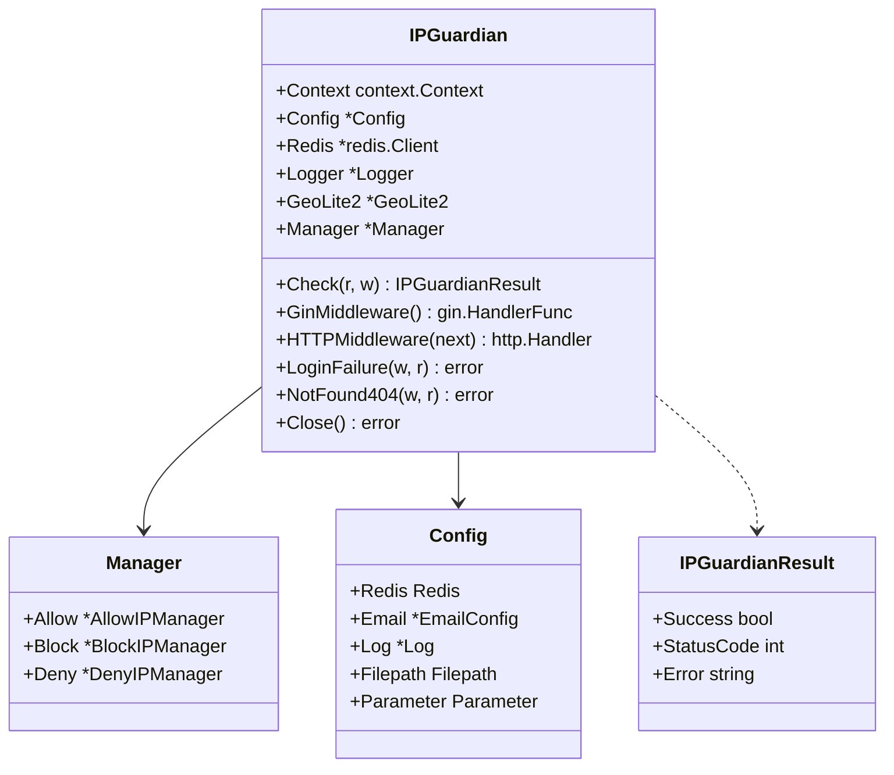
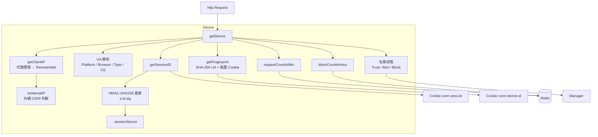
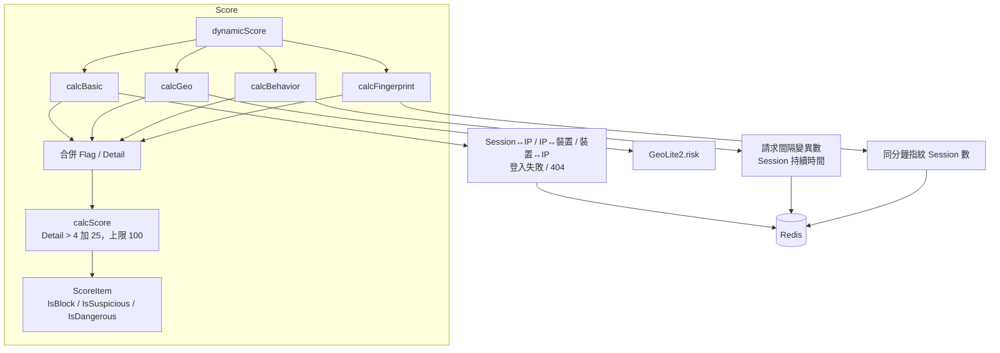
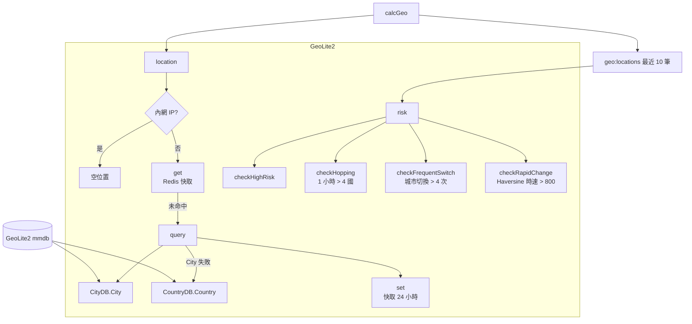
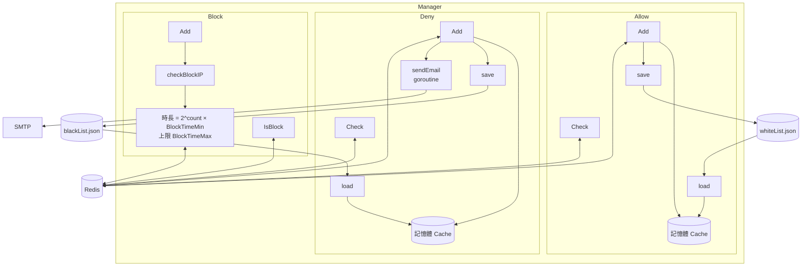
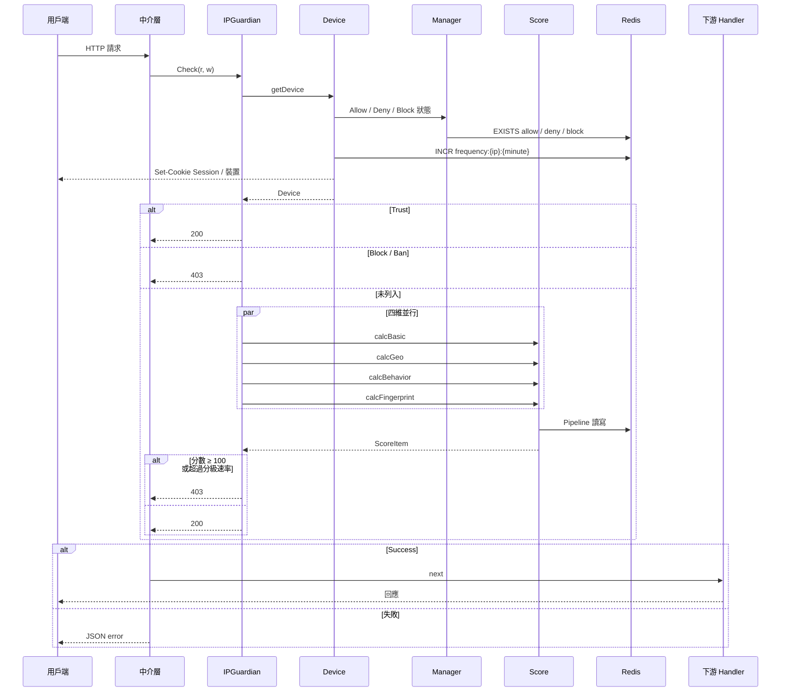
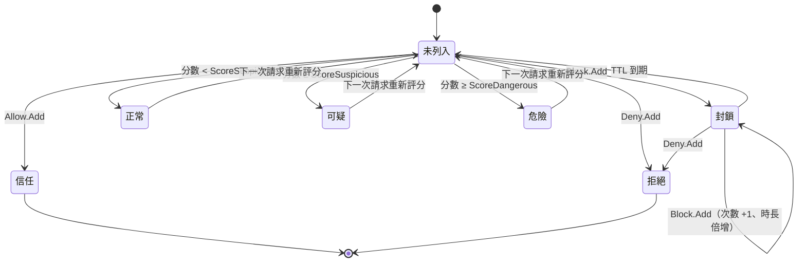

# go-ip-sentry - 架構

最後更新：2026-10-05

> 返回 [README](./README.zh.md)

## 概覽

## 模組：Instance

建立實例、套用預設值並串接檢查流程。

## 模組：Device

由請求解析用戶端 IP、User-Agent、Session 與裝置指紋，並附帶名單狀態與計數。

## 模組：Score

四個維度以 goroutine 並行計算，各自累積分數後以 mutex 合併。

## 模組：GeoLite2

查詢 IP 位置並快取，依最近 10 筆位置歷史判定地理風險。

## 模組：Manager

三層名單：Allow／Deny 為永久名單並持久化至檔案，Block 為帶 TTL 的暫時封鎖。

## 資料流

## 狀態機

單一 IP 在 Check 流程中的狀態。

***

©️ 2025 [邱敬幃 Pardn Chiu](https://www.linkedin.com/in/pardnchiu)
